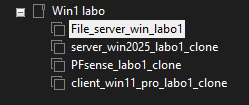
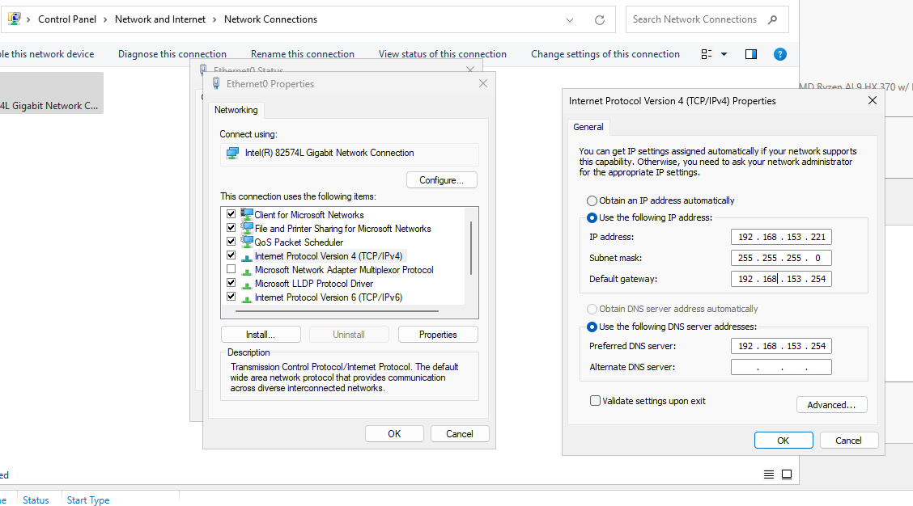
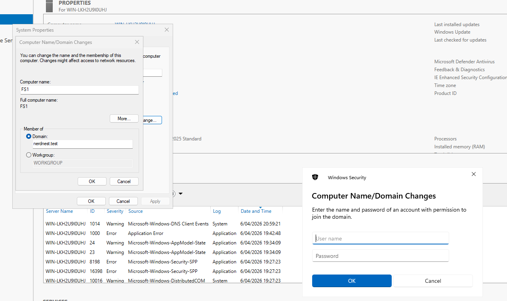
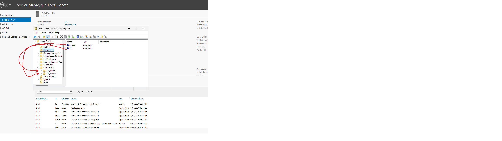
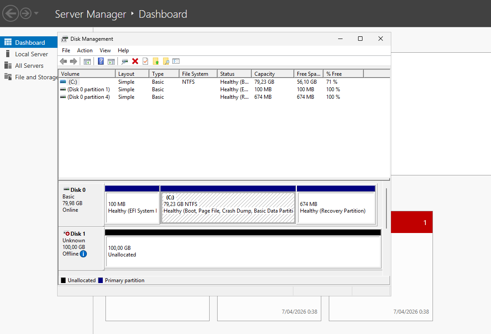
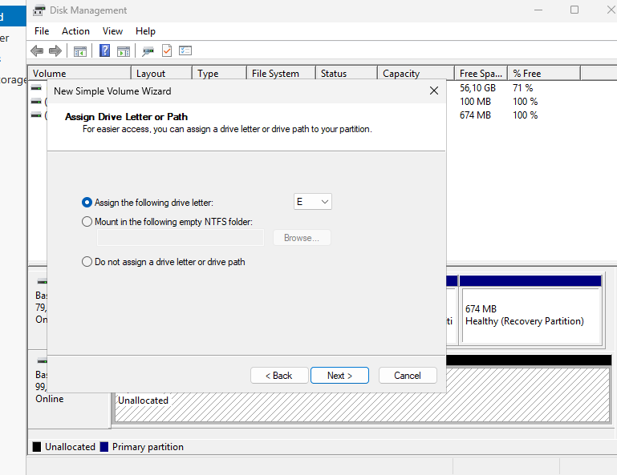
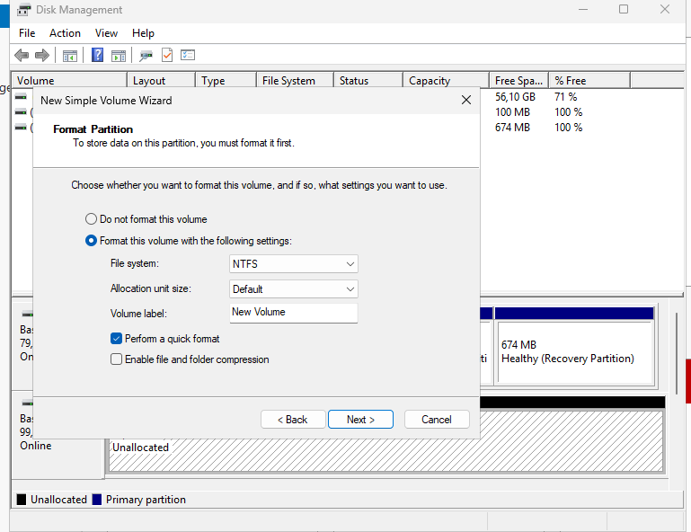
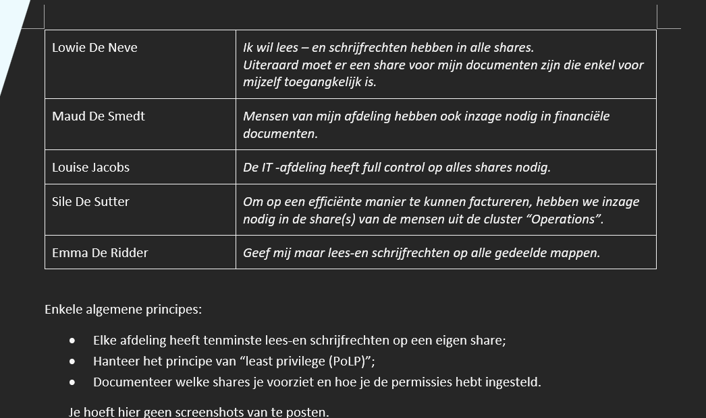
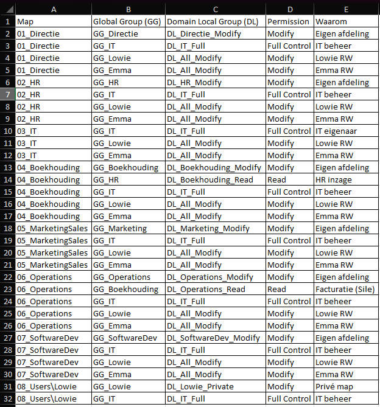

## FILESERVER

CONTEXT : 

First, we are going to add a file server to the domain. A file server is a member server in this domain.
A member server is a device that runs the Windows Server software. It is part of the domain, but it is not a domain controller. 
Meaning it has no copy of the Active Directory. 
The file server is connected to the domain because we will configure permissions based on the users in the Active Directory. 

The first thing we are going to do is update the lab environment by adding a member server. 
This is done by adding a full clone to the lab of an already installed Windows server in VMware. 
It can be a full clone because it is a fresh server before configurations, making it easier. 

With the following fixed IP (same process lab-1) : 

Note: Due to an incorrect DNS configuration, I could not add the file server to the domain.
The issue was identified by a successful `ping` but a failed `nslookup nerdnest.test` ("non-existent domain"). The DNS server was set to `192.168.153.254` (pfSense), which does not host the Active Directory DNS zone.
After changing the DNS to the Domain Controller (`192.168.153.220`), the domain could be resolved and the server successfully joined the domain.

 Next, we are changing the name and adding the file server to the domain (same process lab-1) : 

Name file server: FS1 

Next, let's organise the computers in the DC into the OU we created in lab1 : 

## EXTRA HARD DRIVE 

For best practices, an extra drive is used to separate shared data from the operating system, improving security and management.

This is done in VMware by : 
selecting your server --> RMK --> settings --> add --> select "hard disk" + next --> ... --> create a new disk --> here you give disk size etc and we will select "store virtual disk as a single file"

Next, we will be initialising the  extra disk to make the drive recognizable and usable by Windows. New disks appear as "unknown" and "offline", so they must be initialised before use.

windows + X --> Disk Management 

Here you can see the 100GB which I created, next we will right click on the place that says "Disk 1 unknown 100,00 GB offline" and bring it online, then right-click again and select "Initialize Disk".
After that, right-click on it again and click "Initialize Disk"
After initializing, the space becomes "unallocated". This means the disk exists but cannot yet be used.

To make it usable, right-click on the unallocated space, the 99.95GB. This creates a partition and assigns a drive letter.

select "New Simple Volume"; in the wizard : Next ... -> 

During this process, we format the disk using NTFS, which is required for storing files, sharing data, and managing permissions in a Windows environment.

## FILE STRUCTURE 

instructions : 

"Voorzie een mappenstructuur op nieuwe nieuwe schijf van je file server.
Welke mappen je voorziet, vraag je aan AI. Basseer je op het organogram van de onderneming.
Stel de juiste permissions in. Belangrijk is dat je hiervoor het AGDLP -principe gebruikt.
Hou ook rekening met opmerkingen van volgende collega’s" : 

AGDLP : Users → GG_* → DL_* → Permissions → Folder

continue .. 

