## FILESERVER

CONTEXT : 

First, we are going to add a file server to the domain. A file server is a member server in this domain.
A member server is a device that runs the Windows Server software. It is part of the domain, but it is not a domain controller. 
Meaning it has no copy of the Active Directory. 
The file server is connected to the domain because we will configure permissions based on the users in the Active Directory. 

The first thing we are going to do is update the lab environment by adding a member server. 
This is done by adding a full clone to the lab of an already installed Windows server in VMware. 
It can be a full clone because it is a fresh server before configurations, making it easier. 

With the following fixed IP (same process lab-1) : 

Note: Due to an incorrect DNS configuration, I could not add the file server to the domain.
The issue was identified by a successful `ping` but a failed `nslookup nerdnest.test` ("non-existent domain"). The DNS server was set to `192.168.153.254` (pfSense), which does not host the Active Directory DNS zone.
After changing the DNS to the Domain Controller (`192.168.153.220`), the domain could be resolved and the server successfully joined the domain.

 Next, we are changing the name and adding the file server to the domain (same process lab-1) : 

Name file server: FS1 

Next, let's organise the computers in the DC into the OU we created in lab1 : 

## EXTRA HARD DRIVE 

For best practices, an extra drive is used to separate shared data from the operating system, improving security and management.

This is done in VMware by : 
selecting your server --> RMK --> settings --> add --> select "hard disk" + next --> ... --> create a new disk --> here you give disk size etc and we will select "store virtual disk as a single file"

Next, we will be initialising the  extra disk to make the drive recognizable and usable by Windows. New disks appear as "unknown" and "offline", so they must be initialised before use.

windows + X --> Disk Management 

Here you can see the 100GB which I created, next we will right click on the place that says "Disk 1 unknown 100,00 GB offline" and bring it online, then right-click again and select "Initialize Disk".
After that, right-click on it again and click "Initialize Disk"
After initializing, the space becomes "unallocated". This means the disk exists but cannot yet be used.

To make it usable, right-click on the unallocated space, the 99.95GB. This creates a partition and assigns a drive letter.

select "New Simple Volume"; in the wizard : Next ... -> 

During this process, we format the disk using NTFS, which is required for storing files, sharing data, and managing permissions in a Windows environment.

## FILE STRUCTURE 

instructions : 

"Voorzie een mappenstructuur op nieuwe nieuwe schijf van je file server.
Welke mappen je voorziet, vraag je aan AI. Basseer je op het organogram van de onderneming.
Stel de juiste permissions in. Belangrijk is dat je hiervoor het AGDLP -principe gebruikt.
Hou ook rekening met opmerkingen van volgende collega’s" : 

AGDLP : Users → GG_* → DL_* → Permissions → Folder

Personal notes : 
- Lowie De Neve --> full access + personal OU --> will place this person in Directie 
- Maud De Smedt --> boekhouding must be able to read and execute --> will place this person in boekhouden
- Louise Jacobs --> IT must have full acccess  --> will place this person in IT 
- Sile De Sutter --> asks for giving boekhouden access to operations --> will be in boekhouden 
- Emma De Ridder --> full controle --> IT department

---
In het labo : 
AGDLP : A → G → DL → P

## ACCOUNT

In this step, we create the user accounts in Active Directory and place them in the correct Organisational Units (OU) based on their department. 
**The OU is used for structure and policies, not for assigning permissions.**

Summary of "A" make accounts in DC "Users and computers" :  
- OU=Directie --> Lowie
- OU=Boekhouding --> Maud, Sile
- OU=IT --> Louise, Emma

Accounts; first lets start off by making sure the following accounts are in the OU's : 

TOOLS --> Account Directory Users and Computers --> OUallusers --> RMK --> New User --> .... 

The Accounts will be created for all the above-mentioned users in their OU. 

 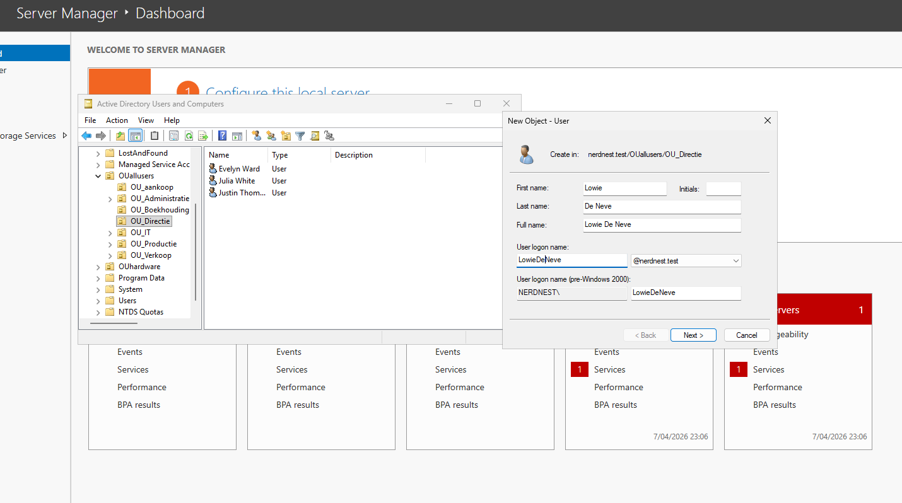

 
## GLOBAL SECURITY GROUPS + DOMAIN LOCAL GROUPS 

These will also be made in the DC server; the AD database is needed for parts A and G because the domain controller is responsible for identity and access management.    

Let's begin by mapping out the Global Security groups we are going to make : 

Global Groups (GG) based on company structure ( the OU's from the first lab) : 

- GG_aankoop
- GG_Administratie
- GG_Boekhouding 
- GG_Directie
- GG_IT 
- GG_Productie
- GG_Verkoop
- GG_Lowie 
- GG_Emma 

Domain Local Groups based on permissions : 

***What will be made for the lab:**

 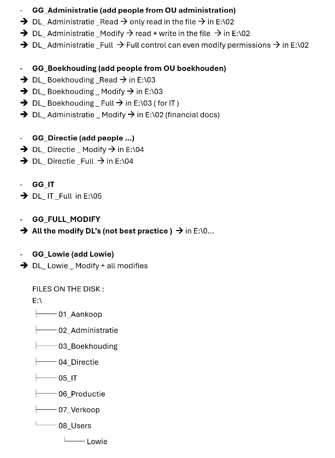

The AGDLP model is used to manage access control.  
Users are grouped into Global Groups based on their department, which are then linked to Domain Local Groups.  
Permissions are assigned to these Domain Local Groups on specific folders, enabling centralized management and adherence to the principle of least privilege.

Making global security groups : 

- select the domain -->  New --> Group 

 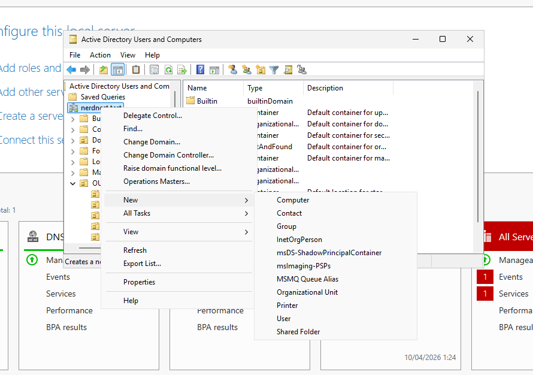

 We are starting with the GG's ( GLOBAL) and the group type is SECURITY 

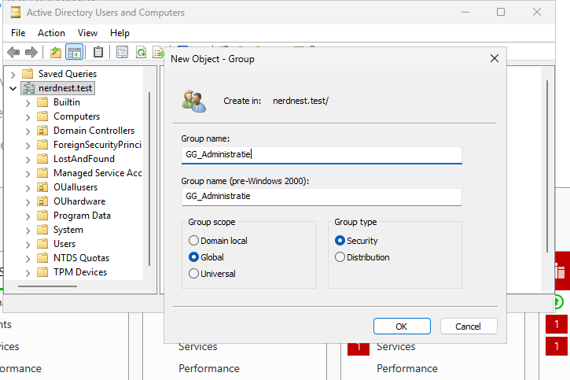

After all the GG's are created, it is time to add the users to the Global Groups. 
Because this was based on the OU's we can go to the OU_Administratie and add all the users to that group. 

once there : CTR + A (select all) --> RMK (on one of the selected people)--> Add to a group 

in select group type you can type GG and it should give the options if you select **"Check Names"**

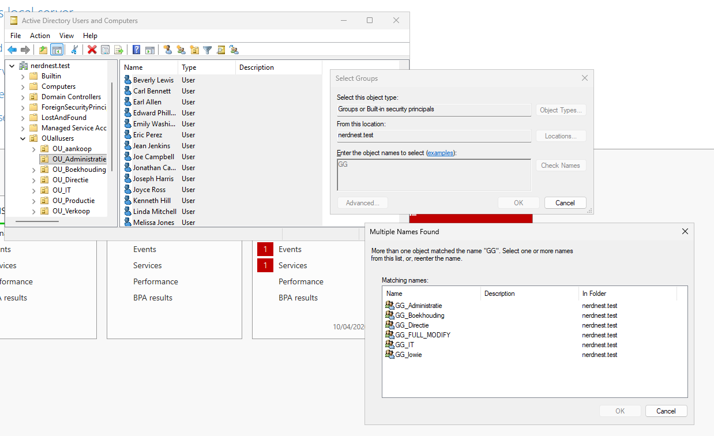

Next we are going to add the Domain Local groups or DL's because they give us the option to give more specific permissions, as shown in the schematic 

Once again :  select the domain -->  New --> Group  

BUT this time we select **Domain Local**

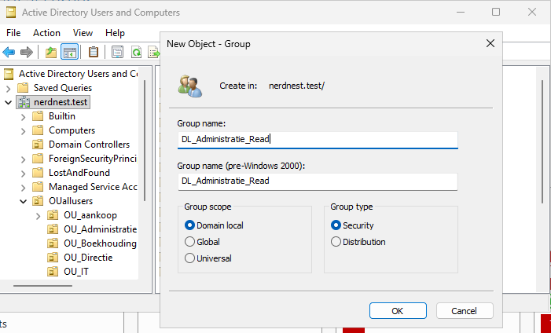

We add the Global Group to the Domain Local Group : 

For example, lets take the GG_boekhouding because is part of 2 DL's and cross-department. 
We will add it to : 

- DL_Administratie_Modify
- DL_Boekhouding_Modify

Select the GLOBAL GROUP you want to add to a DL --> RMK --> add to a group --> "check name" 

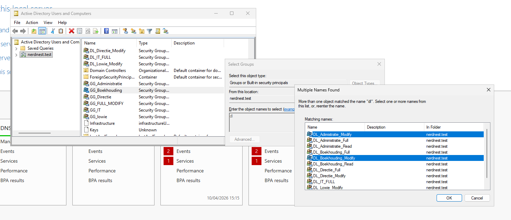

The rest will be done according to the needs of the departments. 

## Permissions 

Here we have to enter the file server to manage the resources themselves. 

As shown before, we will make the file structure like this in the File server on the E disk.

Once the folders are created : 

RMK on the folder --> properties  --> Select the "sharing tab" --> advanced sharing --> click the boc "share this folder"

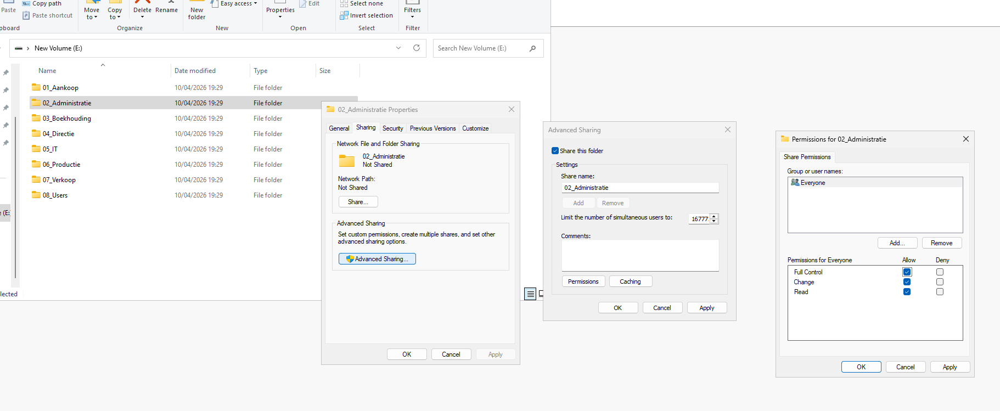

Here we will click on permissions and make sure everyone has full control. This is because the NTFS option in the "Security tab " next to it has more options. 
And ***the most restrictive option gets implemented*

Normally, when you go to the security file, you will get blocked in edit form from making any changes. 
This is because the permissions are inherited. 

To change this : Advanced --> Disable inheritance 

**ALERT!!** 

MAKE SURE TO CHOOSE THE FIRST OPTION: "Convert inherited permissions into explicit permissions on this object"

if you choose the second option, you will throw away everything and if you make a mistake, then the chance is there that you will be locked out of the folder. 

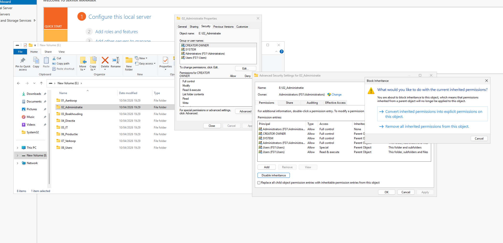

Check which users in the Principal aren't needed and remove them 

Next, we go to edit, in the administration group, we have 3 DL's for permission : Read, Modify and Full. 

In the "Security tab " : Edit -->  Add --> "DL" and "check name"

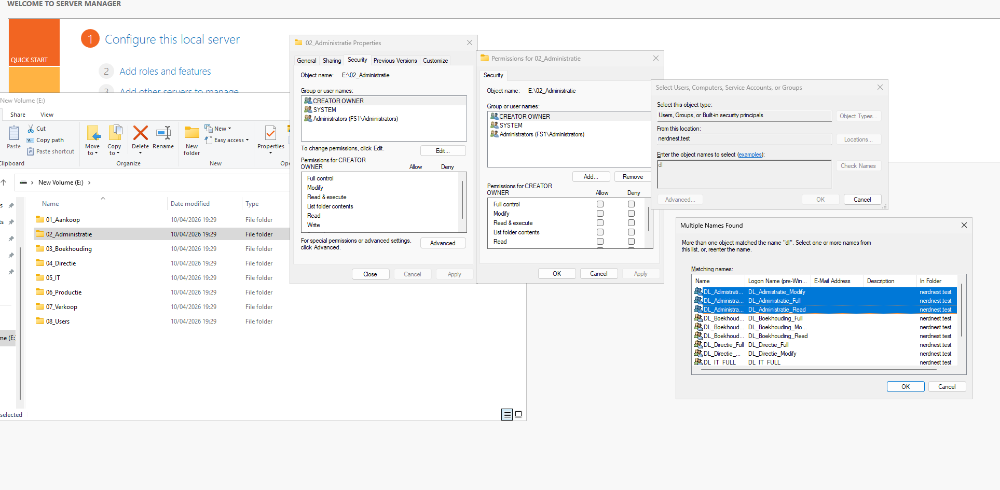

For DL_Administratie_Read We will not select any other options : 

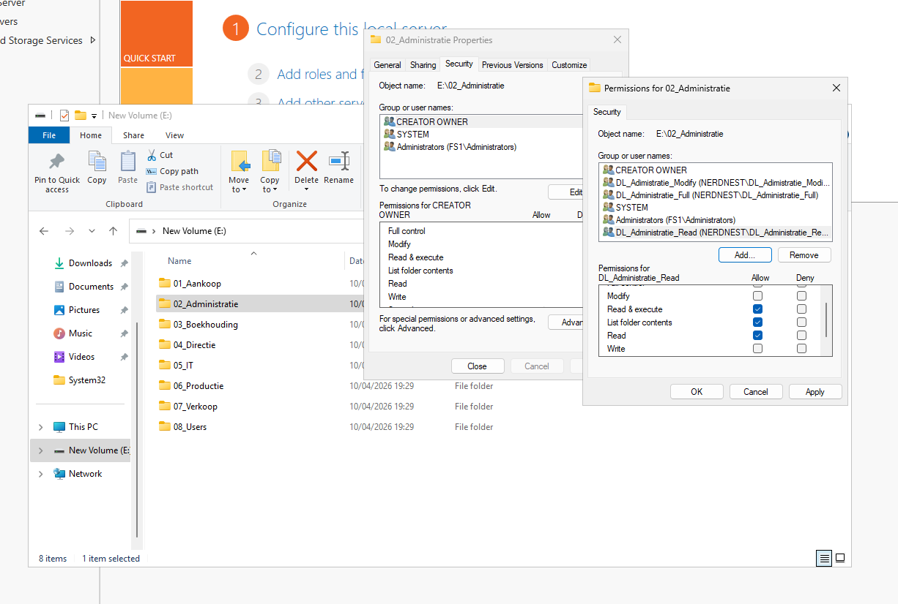

If you select Modify, then Write, and a few other options will automatically get selected 
For full control, it will select everything 

If you go to : Advanced --> Edit and select show advanced permissions in the following screen you will get a more detailed overview of the buncle of permissions in "Modify".

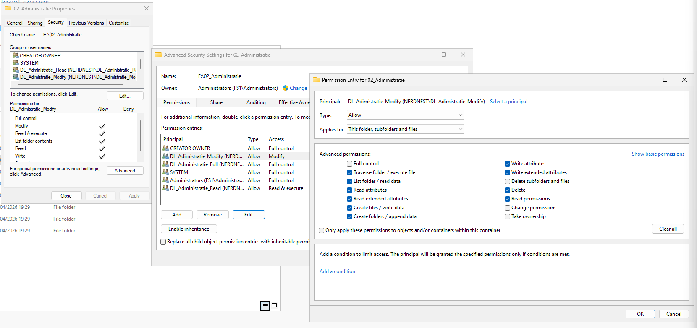

After the permissions are set, if we log in with someone from Administration, this is what we see, 
Note only the Administration and Bookkeeping file have been created at this point. 

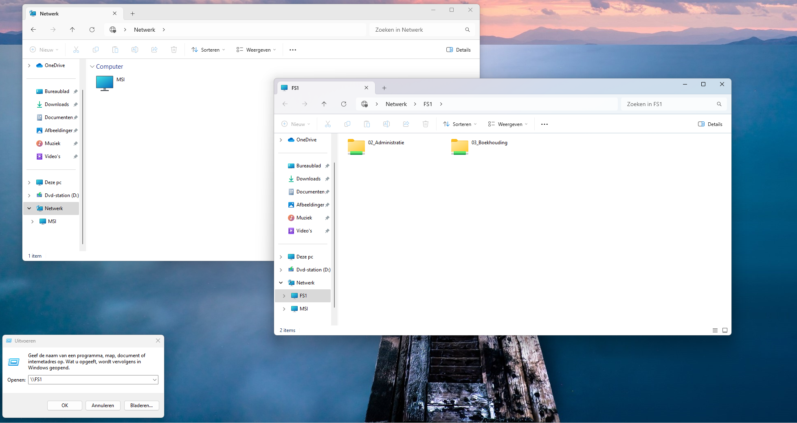

**File Server & Client Network Discovery Issue:**

When I first tested the login, the file server shares were accessible manually (e.g. via \\fs1), 
But the server did not automatically appear under the Network section in File Explorer.

I have done the following troubleshooting in order to fix this ( with the result being the image above) : 

1) Firewall settings: Verified that the Windows Firewall on the client was not blocking file sharing or network discovery.
2) Permissions Verification: Checked Share permissions on the file server and checked NTFS permissions on the shared folders.
3) Active Directory (DC) Check:  Verified user group memberships and permissions on the Domain Controller. + Confirmed that the user had the correct access rights.
4) Network Discovery : Enabled: Network Discovery and checked File and Printer Sharing, verified both the client and file server for this.
5) DNS Configuration: Configured DNS manually via " ncpa.cpl" and set the DNS server to the Domain Controller IP address. Then, verified name resolution "ping fs1".
6) Required Services Configuration :

Set the following services to:

- Startup Type: Automatic
- Status: Running

Services: 

- Function Discovery Resource Publication
- Function Discovery Provider Host
- SSDP Discovery
- UPnP Device Host
- Network Location Awareness

**Important: These services must be configured on both the client and the file server.**

After configuring all required services and enabling network discovery on both systems, a restart of the file server resolved the issue.

---

## Restrictions 

The final part of the lab is to assign a storage limit on the disk and block video sharing. 
In order to do this, we need to have the **File Server Resource Manager**; this role must be installed. 

Go to manage --> Add Roles and Features 
